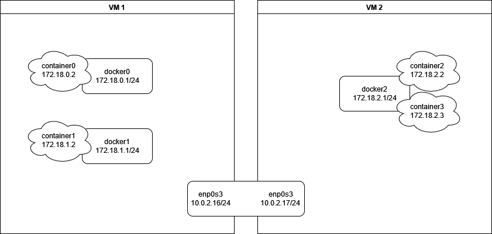

# Netzwerkkonzept PoC

## Versuchsaufbau



## Zustand der VMs ohne OSPF und mit deaktivierter Firewall

### VM1
Netzwerkkonfiguration:
```bash
1: lo: <LOOPBACK,UP,LOWER_UP> mtu 65536 qdisc noqueue state UNKNOWN group default qlen 1000
    link/loopback 00:00:00:00:00:00 brd 00:00:00:00:00:00
    inet 127.0.0.1/8 scope host lo
       valid_lft forever preferred_lft forever
    inet 1.1.1.1/32 brd 1.1.1.1 scope global lo
       valid_lft forever preferred_lft forever
    inet6 ::1/128 scope host
       valid_lft forever preferred_lft forever
2: enp0s3: <BROADCAST,MULTICAST,UP,LOWER_UP> mtu 1500 qdisc fq_codel state UP group default qlen 1000
    link/ether 08:00:27:13:53:9e brd ff:ff:ff:ff:ff:ff
    inet 10.0.2.16/24 brd 10.0.2.255 scope global dynamic noprefixroute enp0s3
       valid_lft 428sec preferred_lft 428sec
    inet6 fe80::4086:4a:e126:c8f7/64 scope link noprefixroute
       valid_lft forever preferred_lft forever
7: docker0: <BROADCAST,MULTICAST,UP,LOWER_UP> mtu 1500 qdisc noqueue state UP group default
    link/ether 02:42:5f:d0:34:8b brd ff:ff:ff:ff:ff:ff
    inet 172.0.0.1/24 brd 172.0.0.255 scope global docker0
       valid_lft forever preferred_lft forever
    inet6 fe80::42:5fff:fed0:348b/64 scope link
       valid_lft forever preferred_lft forever
8: docker1: <BROADCAST,MULTICAST,UP,LOWER_UP> mtu 1500 qdisc noqueue state UP group default
    link/ether 02:42:53:7e:37:6d brd ff:ff:ff:ff:ff:ff
    inet 172.1.1.1/24 brd 172.1.1.255 scope global docker1
       valid_lft forever preferred_lft forever
    inet6 fe80::42:53ff:fe7e:376d/64 scope link
       valid_lft forever preferred_lft forever
```

Containers:
```bash
CONTAINER ID   IMAGE     COMMAND                  CREATED          STATUS          PORTS     NAMES
c1b528fc1945   alpine    "/bin/sh -c 'while t…"   15 minutes ago   Up 15 minutes             container1
c9af8dfa242b   alpine    "/bin/sh -c 'while t…"   15 minutes ago   Up 15 minutes             container0
```

Routing Table:
```bash
default via 10.0.2.1 dev enp0s3 proto dhcp metric 100
10.0.2.0/24 dev enp0s3 proto kernel scope link src 10.0.2.16 metric 100
169.254.0.0/16 dev enp0s3 scope link metric 1000
172.0.0.0/24 dev docker0 proto kernel scope link src 172.0.0.1
172.1.1.0/24 dev docker1 proto kernel scope link src 172.1.1.1
```

### VM2
Netzwerkkonfiguration:
```bash
1: lo: <LOOPBACK,UP,LOWER_UP> mtu 65536 qdisc noqueue state UNKNOWN group default qlen 1000
    link/loopback 00:00:00:00:00:00 brd 00:00:00:00:00:00
    inet 127.0.0.1/8 scope host lo
       valid_lft forever preferred_lft forever
    inet 2.2.2.2/32 brd 2.2.2.2 scope global lo
       valid_lft forever preferred_lft forever
    inet6 ::1/128 scope host
       valid_lft forever preferred_lft forever
2: enp0s3: <BROADCAST,MULTICAST,UP,LOWER_UP> mtu 1500 qdisc fq_codel state UP group default qlen 1000
    link/ether 08:00:27:c7:4c:8b brd ff:ff:ff:ff:ff:ff
    inet 10.0.2.17/24 brd 10.0.2.255 scope global dynamic noprefixroute enp0s3
       valid_lft 571sec preferred_lft 571sec
    inet6 fe80::ec2b:9862:7d5d:470f/64 scope link noprefixroute
       valid_lft forever preferred_lft forever
5: docker2: <BROADCAST,MULTICAST,UP,LOWER_UP> mtu 1500 qdisc noqueue state UP group default
    link/ether 02:42:21:13:d0:ea brd ff:ff:ff:ff:ff:ff
    inet 172.2.2.1/24 brd 172.2.2.255 scope global docker2
       valid_lft forever preferred_lft forever
    inet6 fe80::42:21ff:fe13:d0ea/64 scope link
       valid_lft forever preferred_lft forever
```

Containers:
```bash
CONTAINER ID   IMAGE     COMMAND                  CREATED         STATUS         PORTS     NAMES
e8cffe42693f   alpine    "/bin/sh -c 'while t…"   2 minutes ago   Up 2 minutes             container3
5ffb87b0f7d7   alpine    "/bin/sh -c 'while t…"   3 hours ago     Up 3 hours               container2
```

Routing Table:
```bash
default via 10.0.2.1 dev enp0s3 proto dhcp metric 100
10.0.2.0/24 dev enp0s3 proto kernel scope link src 10.0.2.17 metric 100
169.254.0.0/16 dev enp0s3 scope link metric 1000
172.2.2.0/24 dev docker2 proto kernel scope link src 172.2.2.1
```

### Container Ping Test

```bash
# container0 zu contianer1
PING 172.1.1.2 (172.1.1.2): 56 data bytes
64 bytes from 172.1.1.2: seq=0 ttl=63 time=0.134 ms

# container0 zu container2
--- 172.2.2.2 ping statistics ---
3 packets transmitted, 0 packets received, 100% packet loss

# container0 zu container3
--- 172.2.2.3 ping statistics ---
3 packets transmitted, 0 packets received, 100% packet loss

# container1 zu container0
PING 172.0.0.2 (172.0.0.2): 56 data bytes
64 bytes from 172.0.0.2: seq=0 ttl=63 time=0.087 ms

# container1 zu container2
--- 172.2.2.2 ping statistics ---
3 packets transmitted, 0 packets received, 100% packet loss

# container1 zu container3
--- 172.2.2.3 ping statistics ---
3 packets transmitted, 0 packets received, 100% packet loss

# container2 zu container0
--- 172.0.0.2 ping statistics ---
3 packets transmitted, 0 packets received, 100% packet loss

# container2 zu container1
--- 172.1.1.2 ping statistics ---
3 packets transmitted, 0 packets received, 100% packet loss

# container2 zu container3
PING 172.2.2.3 (172.2.2.3): 56 data bytes
64 bytes from 172.2.2.3: seq=0 ttl=64 time=0.229 ms

# container3 zu container0
--- 172.0.0.2 ping statistics ---
3 packets transmitted, 0 packets received, 100% packet loss

# container3 zu container1
--- 172.1.1.2 ping statistics ---
3 packets transmitted, 0 packets received, 100% packet loss

# container3 zu container2
PING 172.2.2.2 (172.2.2.2): 56 data bytes
64 bytes from 172.2.2.2: seq=0 ttl=64 time=0.051 ms
```

Kommunikationstabelle:
||||||
| ---------- | ---------- | ---------- | ---------- | ----------- |
|            | container0 | container1 | container2 | container 3 |
| container0 | yes | yes | no | no |
| container1 | yes | yes | no | no |
| container2 | no | no | yes | yes |
| container3 | no | no | yes | yes |

## FRR OSPFv2

Die Netzwerkkonfiguration in FRR OSPF aktiviert OSPF auf allen Subnetzen, die im konfigurierten OSPF Subnetz enthalten sind.
Die OSPF Netzwerkkonfiguration `network 192.168.1.0/24 area 0.0.0.0` aktiviert OSPF z.B. auf einem Interface mit der IP 192.168.1.129/25, aber nicht auf einem Interface mit der IP 192.168.1.1/23.

Dies hat folgende drei Konfigurationsoptionen zur Folge:
1. Automatisch werden alle Subnetze der jeweiligen Node z.B. BSP oder CSP per OSPF "advertised" / erreichbar gemacht. Einmalig wird `network 0.0.0.0/0 area 0` konfiguriert.
2. Es wird explizit und 1 zu 1 konfiguriert, welche Subnetze "advertised" werden sollen. Für jedes Subnetz, das mittels OSPF übertragen werden soll, wird eine Konfigurationsregel z.B. `network 192.168.250.1/24 area 0` eingetragen. Dies hat zur Folge, dass mit jedem neuen Subnetz auf der Node analysiert werden muss, ob dieses  Gegebenenfalls muss eine entsprechende Regel konfiguriert werden.
3. Eine Mischung aus 1 und 2. Für machen Subnetze werden Einzelregeln definiert, andere werden unter einer größeren Subnetzregel zusammengefasst.

Konfigurationsaufwände:
| Variante | Vorteile | Nachteile |
| -------- | -------- | --------- |
| 1 | Sehr einfache Konfiguration. Wird ein neues Subnetz auf der Node hinzugefügt, muss die OSPF Konfiguration nicht angepasst werden. | Es können keine Subnetze von der Übertragung ausgenommen werden. |
| 2 | Es können Subnetze von der Übertragung ausgenommen werden. | Komplexere Konfiguration. Mit jedem neuen Subnetz auf der Node muss analysiert werden, ob dieses Subnetz "advertised" werden soll. Mit jedem neuen Subnetz auf der Node muss die OSPF Konfiguration angepasst werden.
| 3 | Es können Subnetze von der Übertragung ausgenommen werden. Potenziell muss nicht mit jedem neuen Subnetz die OSPF Konfiguration angepasst werden. | Sehr komplexe Konfiguration. Bei jedem neuen Subnetz muss analysiert werden, ob dieses "advertised" werden soll. Auch muss geprüft werden, ob das Subnetz bereits in einer OSPF Konfigurationsregel abgebildet ist. Ist dies der Fall, aber das Subnetz soll nicht übertragen werden, muss eine grobere OSPF Konfiguration in mehrere, spezifischere Regeln unterteilt werden. Changes bzgl. eines neuen Subnetzes sind nicht einheitlich.

## Zustand der VMs mit OSPF in Variante 1 und mit deaktivierter Firewall

### VM1
OSPF Config:
```bash
frr version 8.1
frr defaults traditional
hostname ospf1
log syslog informational
no ipv6 forwarding
service integrated-vtysh-config
!
interface lo
 ip address 1.1.1.1/32
exit
!
router ospf
 network 0.0.0.0/0 area 0
exit
!
```

Routing Table:
```bash
default via 10.0.2.1 dev enp0s3 proto dhcp metric 100
2.2.2.2 nhid 30 via 10.0.2.17 dev enp0s3 proto ospf metric 20
10.0.2.0/24 dev enp0s3 proto kernel scope link src 10.0.2.16 metric 100
169.254.0.0/16 dev enp0s3 scope link metric 1000
172.0.0.0/24 dev docker0 proto kernel scope link src 172.0.0.1
172.1.1.0/24 dev docker1 proto kernel scope link src 172.1.1.1
172.2.2.0/24 nhid 30 via 10.0.2.17 dev enp0s3 proto ospf metric 20
```

### VM2
OSPF Config VM2:
```bash
frr version 8.1
frr defaults traditional
hostname ospf2
log syslog informational
no ipv6 forwarding
service integrated-vtysh-config
!
interface lo
 ip address 2.2.2.2/32
exit
!
router ospf
 network 0.0.0.0/0 area 0
exit
!
```

Routing Table:
```bash
default via 10.0.2.1 dev enp0s3 proto dhcp metric 100
1.1.1.1 nhid 22 via 10.0.2.16 dev enp0s3 proto ospf metric 20
10.0.2.0/24 dev enp0s3 proto kernel scope link src 10.0.2.17 metric 100
169.254.0.0/16 dev enp0s3 scope link metric 1000
172.0.0.0/24 nhid 22 via 10.0.2.16 dev enp0s3 proto ospf metric 20
172.1.1.0/24 nhid 22 via 10.0.2.16 dev enp0s3 proto ospf metric 20
172.2.2.0/24 dev docker2 proto kernel scope link src 172.2.2.1
```

### Container Ping Test

```bash
# container0 zu contianer1
PING 172.1.1.2 (172.1.1.2): 56 data bytes
64 bytes from 172.1.1.2: seq=0 ttl=63 time=0.134 ms

# container0 zu container2
PING 172.2.2.2 (172.2.2.2): 56 data bytes
64 bytes from 172.2.2.2: seq=0 ttl=62 time=0.499 ms

# container0 zu container3
PING 172.2.2.3 (172.2.2.3): 56 data bytes
64 bytes from 172.2.2.3: seq=0 ttl=62 time=0.421 ms

# container1 zu container0
PING 172.0.0.2 (172.0.0.2): 56 data bytes
64 bytes from 172.0.0.2: seq=0 ttl=63 time=0.087 ms

# container1 zu container2
PING 172.2.2.2 (172.2.2.2): 56 data bytes
64 bytes from 172.2.2.2: seq=0 ttl=62 time=0.423 ms

# container1 zu container3
PING 172.2.2.3 (172.2.2.3): 56 data bytes
64 bytes from 172.2.2.3: seq=0 ttl=62 time=0.596 ms

# container2 zu container0
PING 172.0.0.2 (172.0.0.2): 56 data bytes
64 bytes from 172.0.0.2: seq=0 ttl=62 time=0.476 ms

# container2 zu container1
PING 172.1.1.2 (172.1.1.2): 56 data bytes
64 bytes from 172.1.1.2: seq=0 ttl=62 time=0.449 ms

# container2 zu container3
PING 172.2.2.3 (172.2.2.3): 56 data bytes
64 bytes from 172.2.2.3: seq=0 ttl=64 time=0.126 ms

# container3 zu container0
PING 172.0.0.2 (172.0.0.2): 56 data bytes
64 bytes from 172.0.0.2: seq=0 ttl=62 time=0.495 ms

# container3 zu container1
PING 172.1.1.2 (172.1.1.2): 56 data bytes
64 bytes from 172.1.1.2: seq=0 ttl=62 time=0.496 ms

# container3 zu container2
PING 172.2.2.3 (172.2.2.3): 56 data bytes
64 bytes from 172.2.2.3: seq=0 ttl=64 time=0.035 ms
```

Kommunikationstabelle:
||||||
| ---------- | ---------- | ---------- | ---------- | ----------- |
|            | container0 | container1 | container2 | container 3 |
| container0 | yes | yes | yes | yes |
| container1 | yes | yes | yes | yes |
| container2 | yes | yes | yes | yes |
| container3 | yes | yes | yes | yes |


Debugging Aufwand bei Netzwerkfehlern betrachten.
